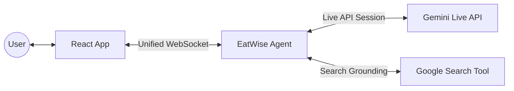

# EatWise AI 🥗

**EatWise AI** is your personal, multimodal food safety assistant. Using the cutting-edge **Gemini Multimodal Live API**, it helps you determine if a food product is safe for you to consume based on your specific dietary restrictions, allergies, and lifestyle choices.

Whether you're grocery shopping, dining out, or checking your pantry, EatWise AI listens, sees, and understands your needs in real-time.

The agent can understand and respond to voice, images, and text. It is designed for natural conversations, can handle interruptions and limits its interactions to food safety related conversations.

---

## Testing instructions

You can test the agent through deployed web based application at https://eatwise-frontend-477953542175.us-central1.run.app/

Contact sidharth.sehgal@gmail.com if you experience any issues.

---

## ✨ Key Features

- **🎙️ Real-time Voice Interaction**: Talk to the assistant naturally. Tell it your allergies, ask about a dish, or narrate what you're seeing.
- **📷 Multimodal Intelligence**:
  - **Product Visuals**: Show the assistant a photo of a product to identify it.
  - **Ingredient Labels**: Snap a photo of a label, and the assistant will read the ingredients to find hidden allergens.
  - **Barcode Scanning**: Show a barcode or say the number. The system uses **Google Search grounding** to find exact product details and ingredient lists.
- **💬 Text & URL Support**: Type a product name or paste a URL to a product page for a quick safety check.
- **🚀 Fast & Responsive**: Optimized for low-latency voice responses with sub-second turn-taking.
- **📱 Mobile Ready**: Designed to be used on the go as a Web App (PWA) on your smartphone.

---

## 🛠️ How It Works

EatWise AI is built on a modern, decoupled architecture designed for high-performance streaming.

### The Tech Stack
- **Frontend**: React (Vite) + Vanilla CSS. Uses the `AudioContext` API for real-time PCM audio streaming.
- **Backend**: FastAPI (Python) handles the orchestration between the client and the AI models.
- **AI Core**: 
  - **Gemini 2.5 Flash (Native Audio Preview)**: Powers the Live WebSocket session for voice and vision.
  - **Google Search Tool**: Provides the assistant with up-to-date product information for barcode lookups.
- **Infrastructure**: Fully containerized with Docker and ready for **Google Cloud Run** deployment.

### The Flow
1. **Connect**: The React client opens a secure WebSocket (`wss://`) to the FastAPI backend.
2. **Stream**: Audio from the mic is converted to 16kHz PCM and streamed directly to Gemini.
3. **Analyze**: When you show a barcode or label, the agent processes the frame, looks up ingredients if needed, and cross-references them against your stated "Dietary Profile."
4. **Respond**: The agent speaks back to you instantly with a clear **SAFE** or **UNSAFE** verdict.

---

## 🏗️ Architecture

You can find a detailed visual breakdown in [architecture.md](./architecture.md).

---

## 🚀 Getting Started

To run or deploy this project yourself, please refer to our detailed **[Deployment Guide](./deployment_guide.md)**.

1. **Clone the repo.**
2. **Setup environment variables** (`GEMINI_API_KEY`).
3. **Run locally** or deploy to **Google Cloud Run**.

---

*Powered by Google Gemini 2.5 and the google-genai SDK.*
