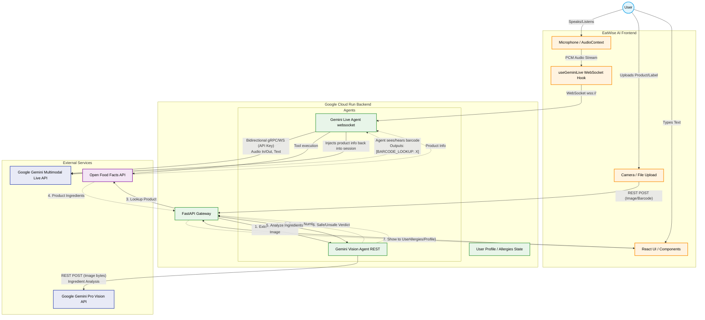

# EatWise AI Architecture

Below is the visual architecture diagram for the EatWise AI application. 

## Component Breakdown

1. **Frontend (React / Vite) hosted on Cloud Run via Nginx**:
   - **`useGeminiLive` Hook**: Manages the `AudioContext`, converting the microphone's 16kHz audio into binary PCM chunks and streaming them directly over a secure WebSocket (`wss://`) to your backend.
   - **UI Components**: Collects user dietary restrictions (allergies, vegan, etc.) and handles manual image/barcode uploads.

2. **Backend (FastAPI) hosted on Cloud Run via Uvicorn**:
   - **`main.py` (API Gateway)**: Handles standard REST requests (like barcode scanning and ingredient label processing) using standard HTTP POST methods.
   - **`agent.py` (Live Voice Agent)**: Manages the WebSocket connection from the frontend. It takes the incoming audio/video/text, wraps it in the `google-genai` SDK formats, and establishes a secondary, real-time connection to Google's Gemini server.
   - **`vision.py` & `tools.py`**: Helper modules that make standard REST API calls to Gemini Vision (for reading labels) or the Open Food Facts API (to look up barcode numbers).

3. **External Services**:
   - **Gemini Multimodal Live API**: The core voice model (`gemini-2.5-flash-native-audio-preview`) that listens to the user, understands context, and speaks back in sub-second latency. Connects using your API Key.
   - **Gemini Pro Vision API**: Used as a one-off tool to extract text from labels and barcode numbers from images.
   - **Open Food Facts API**: A free, open database of food products. The backend queries this whenever the user scans a barcode (or when the Voice Agent explicitly requests a barcode lookup).
