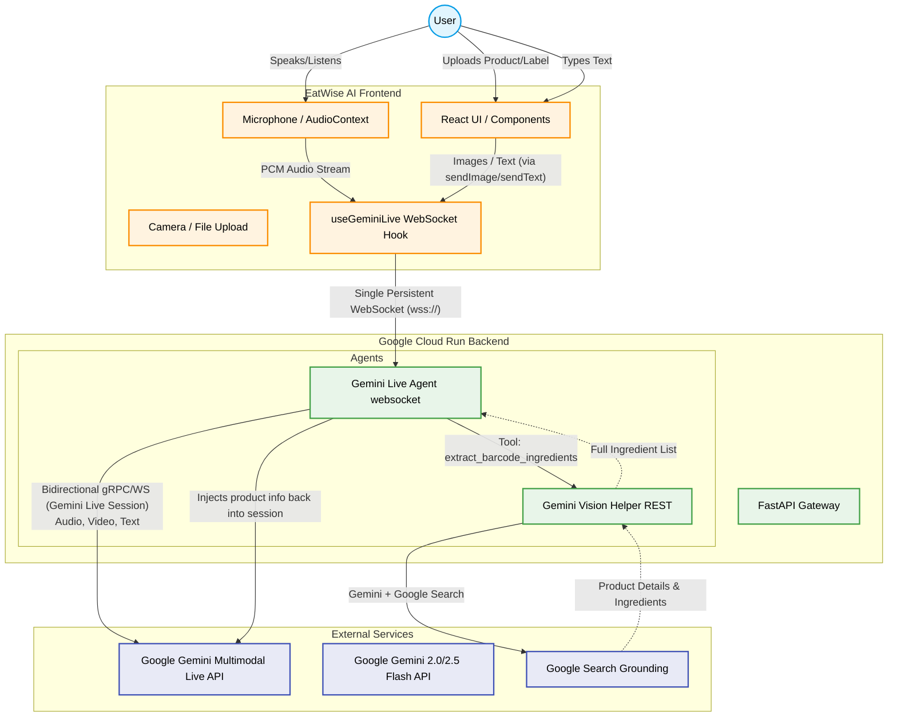

# EatWise AI Architecture

Below is the visual architecture diagram for the EatWise AI application. 

## Component Breakdown

1. **Frontend (React / Vite)**:
   - **`useGeminiLive` Hook**: The single point of contact for the backend. It manages the `AudioContext` for voice and packages manual inputs (text, camera captures, and file uploads) to be sent over the **same WebSocket stream**.
   - **UI Components**: Provides the user with a streamlined "Product Lookup" interface, including a camera overlay and text field.

2. **Backend (FastAPI)**:
   - **`agent.py` (The Heart)**: Manages the WebSocket connection from the frontend. It establishes a real-time, bidirectional session with Google's Gemini models. It handles audio chunking, user interruptions, and multimodal tool calling.
   - **`tools.py` (The Researcher)**: A dedicated module used by the agent to perform deep searches. Instead of relying on static databases (like Open Food Facts), it uses **Gemini with Google Search grounding** to find the most accurate and up-to-date ingredient lists for any product or barcode.
   - **`vision.py` (The Analyst)**: Provides specialized vision processing for analyzing ingredient labels when the user uploads a photo.

3. **External Services**:
   - **Gemini Multimodal Live API**: The core "brain" (`gemini-2.5-flash-native-audio-preview`) that maintains the conversation state, understands your diet, and provides the safety verdict.
   - **Google Search Grounding**: Allows the AI to look up millions of products across the web in real-time, ensuring we never have "missing" barcodes.

## Key Flow: The "Unified WebSocket"
Unlike traditional REST-heavy apps, EatWise AI uses a **decoupled WebSocket architecture**. 
- Even when you take a photo or type text, it is sent via the persistent WebSocket connection.
- This allows the Gemini session to "see" your input while it's still "listening" to you, creating a seamless, interruptible voice-and-vision experience.
