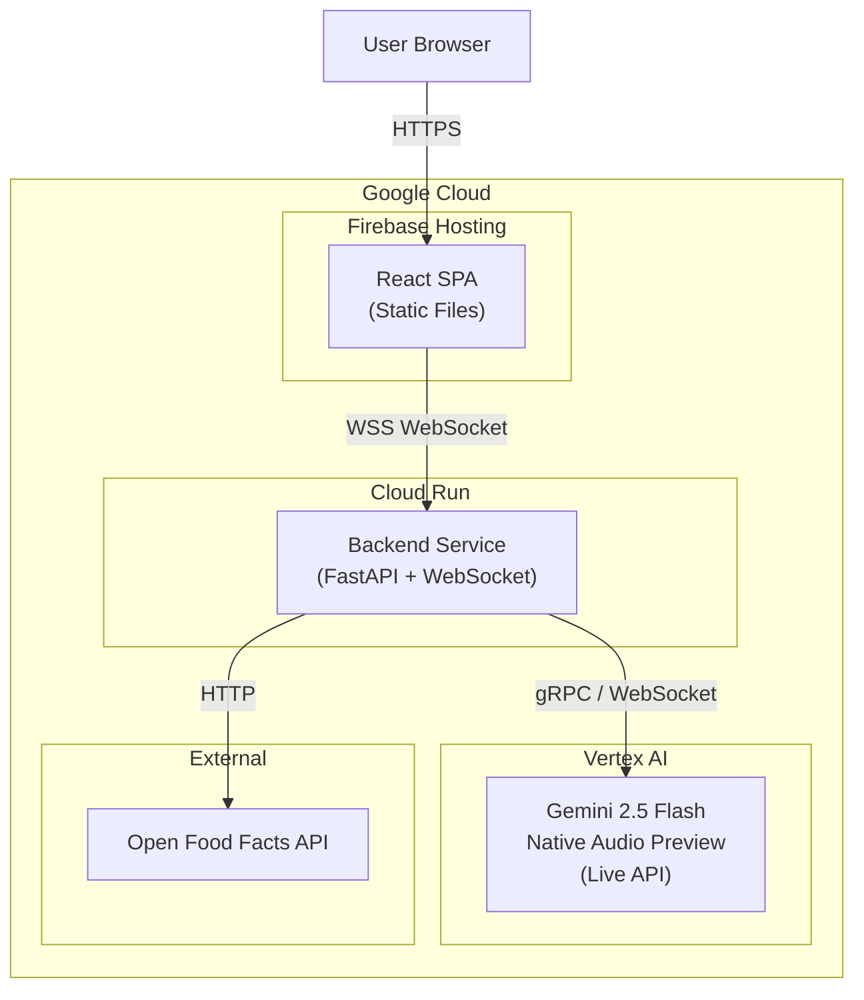

# Deployment Guide: DietAllergy AI → Google Cloud + Vertex AI

## Prerequisites
- [Google Cloud SDK (`gcloud`)](https://cloud.google.com/sdk/docs/install) installed
- A GCP Project with billing enabled
- Docker installed (for local testing; Cloud Build handles it in production)

---

## Step 1: GCP Project Setup

```bash
# Set your project
gcloud config set project YOUR_PROJECT_ID

# Enable required APIs (one-liner for Windows/Mac/Linux)
gcloud services enable run.googleapis.com cloudbuild.googleapis.com artifactregistry.googleapis.com aiplatform.googleapis.com
```

> [!NOTE]
> `aiplatform.googleapis.com` is the Vertex AI API — this is what powers the Gemini Live session.

---

## Step 2: Deploy the Backend to Cloud Run

Your existing `backend/Dockerfile` is already production-ready.

### 2a. Configure environment variables

The backend uses `get_vertex_client()` which checks for `GOOGLE_CLOUD_PROJECT` and `GOOGLE_CLOUD_LOCATION`. On Cloud Run, the project is auto-detected, but you must set the location.

### 2b. Build and deploy

```bash
cd backend

# Deploy directly from source (One-liner for all platforms)
gcloud run deploy eatwise-backend --source . --region us-central1 --platform managed --allow-unauthenticated --set-env-vars "GOOGLE_CLOUD_PROJECT=YOUR_PROJECT_ID,GOOGLE_CLOUD_LOCATION=us-central1" --memory 512Mi --timeout 3600 --session-affinity
```

> [!IMPORTANT]
> Key flags explained:
> - `--timeout 3600`: WebSocket connections for Live API sessions can be long-lived (up to 15 min). Default Cloud Run timeout is 300s.
> - `--session-affinity`: Ensures WebSocket connections stick to the same instance.
> - `--allow-unauthenticated`: Makes the endpoint publicly accessible. For production, consider using IAP or Firebase Auth.

### 2c. Note the backend URL

After deployment, Cloud Run will output a URL like:
```
https://dietallergy-backend-XXXXX-uc.a.run.app
```
Copy this — you'll need it for the frontend.

### 2d. Grant Vertex AI permissions

The Cloud Run service account needs Vertex AI access. Run these commands in your terminal:

**Windows (PowerShell):**
```powershell
# Get the project number
$projectNumber = gcloud projects describe YOUR_PROJECT_ID --format='value(projectNumber)'

# Grant the Vertex AI User role
gcloud projects add-iam-policy-binding YOUR_PROJECT_ID --member="serviceAccount:${projectNumber}-compute@developer.gserviceaccount.com" --role="roles/aiplatform.user"
```

**Mac / Linux (Bash):**
```bash
# Get the project number
PROJECT_NUMBER=$(gcloud projects describe YOUR_PROJECT_ID --format='value(projectNumber)')

# Grant the Vertex AI User role
gcloud projects add-iam-policy-binding YOUR_PROJECT_ID --member="serviceAccount:${PROJECT_NUMBER}-compute@developer.gserviceaccount.com" --role="roles/aiplatform.user"
```

---

## Step 3: Deploy the Frontend

### Option A: Firebase Hosting (Recommended)

```bash
cd frontend

# Install Firebase CLI if you haven't
npm install -g firebase-tools

# Login and init
firebase login
firebase init hosting
# Select your GCP project
# Set public directory to: dist
# Configure as SPA: Yes
# Auto-deploy: No

# Update the backend URL in your code
# In src/hooks/useGeminiLive.js, replace:
#   ws://localhost:8080/ws
# with:
#   wss://dietallergy-backend-XXXXX-uc.a.run.app/ws
# (note: wss:// not ws:// for production)

# Build and deploy
npm run build
firebase deploy --only hosting
```

### Option B: Cloud Run (Static Container)

```bash
cd frontend
npm run build

# Create a simple Dockerfile for the static build
# (see below, or use nginx)
```

Example `frontend/Dockerfile`:
```dockerfile
FROM nginx:alpine
COPY dist/ /usr/share/nginx/html
EXPOSE 8080
CMD ["nginx", "-g", "daemon off;"]
```

```bash
gcloud run deploy dietallergy-frontend \
  --source . \
  --region us-central1 \
  --platform managed \
  --allow-unauthenticated
```

---

## Step 4: Update Frontend WebSocket URL

Before deploying the frontend, update the WebSocket URL in `useGeminiLive.js`:

```diff
- const ws = new WebSocket('ws://localhost:8080/ws');
+ const ws = new WebSocket('wss://dietallergy-backend-XXXXX-uc.a.run.app/ws');
```

> [!CAUTION]
> Use `wss://` (secure WebSocket) in production, not `ws://`. Cloud Run enforces HTTPS.

---

## Step 5: Mobile Access

Once deployed, your app is accessible from any device with an internet connection:

1. **Open the URL**: Simply open the Firebase or Cloud Run frontend URL on your mobile browser (Safari/Chrome).
2. **QR Code**: Generate a QR code for your URL to easily scan it with your phone's camera.
3. **Add to Home Screen**: 
   - **iOS (Safari)**: Tap "Share" → "Add to Home Screen"
   - **Android (Chrome)**: Tap the three dots → "Install app"
   This will add an icon to your phone, making EatWise AI feel like a native mobile app.

---

## Step 6: Verify

| Test | How |
|------|-----|
| Health check | `curl https://dietallergy-backend-XXXXX-uc.a.run.app/health` |
| Audio flow | Open the frontend URL → tap mic → speak |
| Image flow | Upload a product photo → agent responds |
| Barcode (voice) | Say "Check barcode 3017620422003" |

---

## Architecture on GCP



---

## Cost Considerations

| Resource | Pricing Model |
|----------|--------------|
| **Cloud Run** | Pay-per-request + CPU/memory time. Free tier: 2M requests/month |
| **Vertex AI (Gemini)** | Per-token pricing for audio input/output. See [Gemini pricing](https://cloud.google.com/vertex-ai/generative-ai/pricing) |
| **Firebase Hosting** | Free tier: 10 GB storage, 360 MB/day transfer |

> [!TIP]
> For development/testing, set Cloud Run `--min-instances 0` (default) so you only pay when the service is in use. For production with low latency requirements, set `--min-instances 1` to avoid cold starts.
